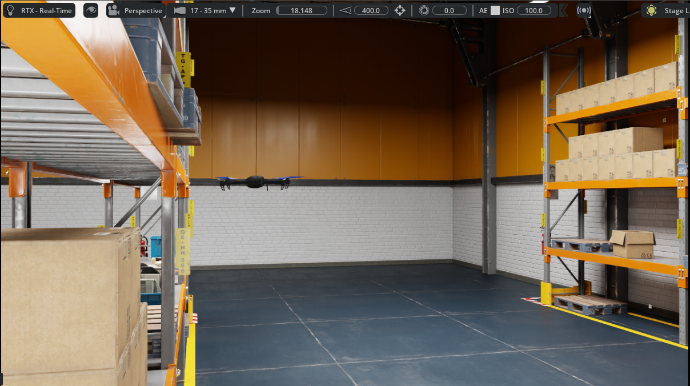
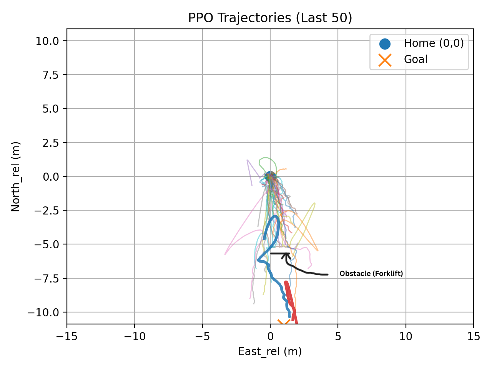

# Isaac-Sim-RL

The project investigates a progressive reinforcement learning–driven autonomy for UAVs, beginning with **PPO-based micro-waypoint** navigation in a fixed simulation environment and extending toward **camera-based (monocular and stereo)** vision policies for obstacle avoidance. Building upon learned goal-directed control, the framework is designed to incorporate **perception-aware decision making**, enabling policies conditioned on visual observations rather than purely geometric state inputs. The research direction advances toward **bird’s-eye-view (BEV)–aware multi-agent localization** and coordination, where multiple UAVs share spatial context for cooperative navigation.

## Stage 1: Integrating PPO-Driven RL Policy using PX4 Offboard Control

Unlike high-level planners, the proposed system directly learns micro-waypoint navigation policies that output continuous position setpoints in the NED frame. The learned policy demonstrates stable convergence to goal locations, obstacle avoidance, and generalizable behavior under deterministic inference.

| Component | Description                       |
| --------- | --------------------------------- |
| ΔN        | Normalized North distance to goal |
| ΔE        | Normalized East distance to goal  |
| Roll      | UAV roll angle                    |
| Pitch     | UAV pitch angle                   |

The action space includes:

| Action | Description          |
| ------ | -------------------- |
| aₙ     | Northward micro-step |
| aₑ     | Eastward micro-step  |

Rewards Function is designed to be:

r = 3 · (dₜ₋₁ − dₜ)
    − 0.005 · ||a||²
    − 0.001
    + 10.0   if goal reached

