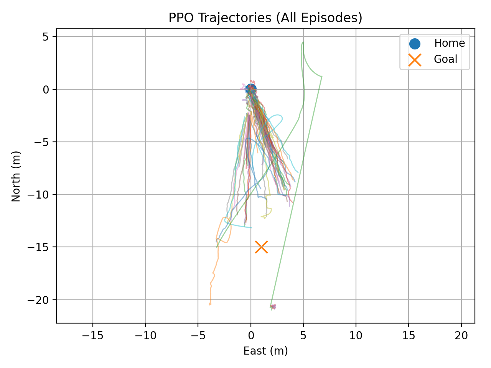

# Isaac-Sim-RL

NVIDIA Isaac Sim warehouse.usd environment

## Stage 1: Integrating PPO-Driven RL Policy using PX4 Offboard Control

Below is the visualization of trajectories of the drone avoiding obstacles at to navigate to (-15,1) setpoint

